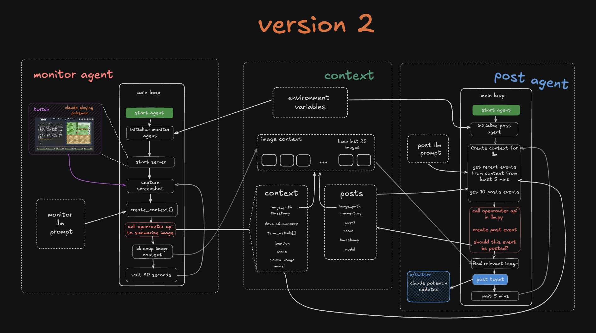

## Claude Pokemon Updates

This is an AI agent that autonomously watches [Claude plays Pokemon](https://www.twitch.tv/claudeplayspokemon) and posts updates to [x/twitter](https://x.com/claudetracker_)

Current Architecture:


### Requirements

- python 3.12
- x developer account
- openrouter api
- uv package manager

### Setup

1. Add these enviroment variables to a .env file
	```
	# Bot settings
	TWITCH_CHANNEL=<Name of the twitch channel>
	AGENT_BOOT_WAIT=<How long to wait (mins) before starting agent loop>
	MONITOR_INTERVAL=<How long to wait (mins) before next screencap>
	POST_INTERVAL=<How long should the posting agent wait (mins) before next evaluation>
	
	# Openrouter credentials
	OPENROUTER_API_KEY=

	# X API credentials
	X_API_KEY=
	X_API_SECRET=
	X_ACCESS_TOKEN=
	X_ACCESS_SECRET=
	X_ENABLED=<set to `true` if you're posting to twitter else 'false'>
	```

2. Run the twitch monitoring agent
	```
	uv run monitor.py
	```
3. Run the posting agent in another tab
	```
	uv run post.py
	```

3. To stop the bot press `ctrl` + `c`
