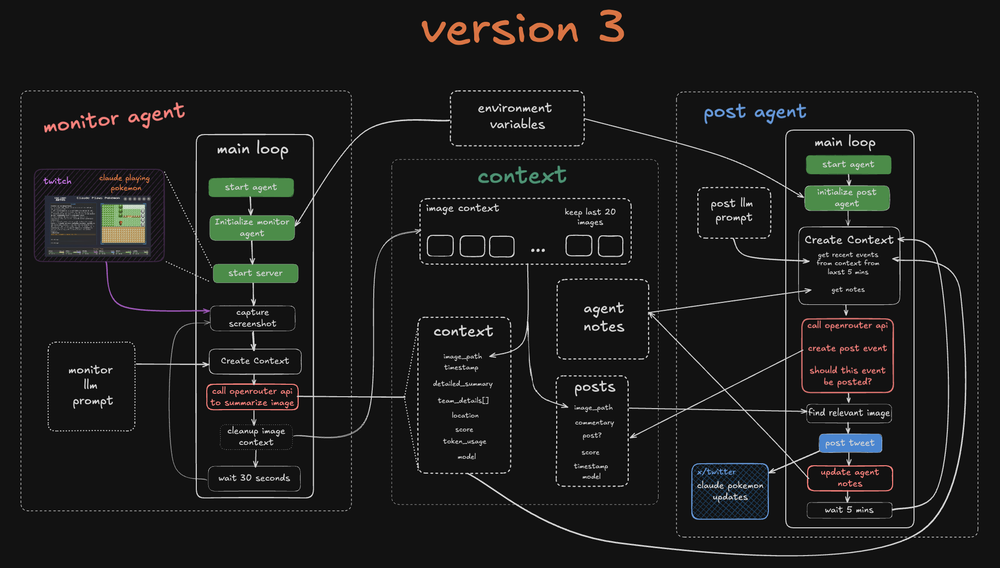

## Claude Pokemon Updates

This is an AI agent that autonomously watches [Claude plays Pokemon](https://www.twitch.tv/claudeplayspokemon) and posts updates to [x/twitter](https://x.com/claudetracker_)

### How does it work?

1. Monitoring agent captures screenshots from the twitch stream

2. Screenshots are run through an llm to get an analysis and other metadata about the game. This is saved to context.jsonl

3. The post agent uses the events from the past 5 mins along with long running agent notes to create a tweet and determine whether it should be posted

4. The agent saves the tweet to posts.jsonl and updates in agent notes.

### Current Architecture:


### Requirements

- python 3.12
- x developer account (for tweeting)
- openrouter api (for llms)
- uv (python package manager)

### Setup

1. Add these enviroment variables to a `.env` file
	```
	# Bot settings
	TWITCH_CHANNEL=<Name of the twitch channel>
	AGENT_BOOT_WAIT=<How long to wait (mins) before starting agent loop>
	MONITOR_INTERVAL=<How long to wait (mins) before next screencap>
	POST_INTERVAL=<How long should the posting agent wait (mins) before next evaluation>
	
	# Openrouter credentials
	OPENROUTER_API_KEY=

	# X API credentials
	X_API_KEY=
	X_API_SECRET=
	X_ACCESS_TOKEN=
	X_ACCESS_SECRET=
	X_ENABLED=<set to `true` if you're posting to twitter else 'false'>
	```

2. Run the twitch monitoring agent
	```
	uv run monitor.py
	```
3. Run the posting agent in another tab
	```
	uv run post.py
	```

3. To stop the bot press `ctrl` + `c`
