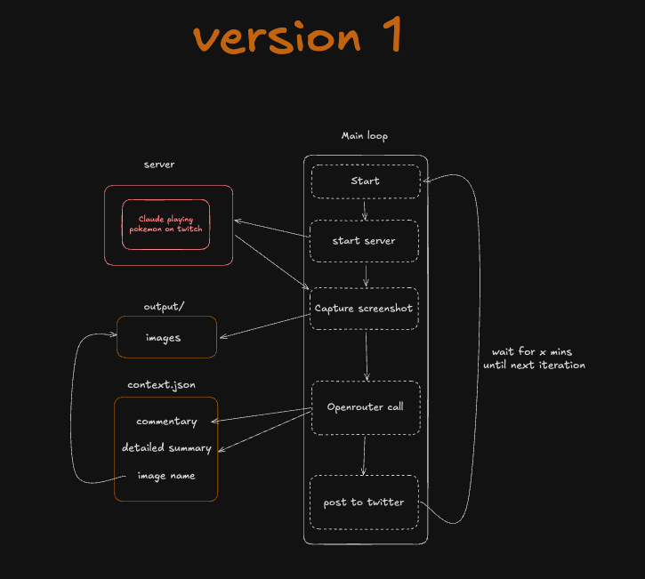

## Claude Pokemon Watch

This is an AI bot that captures screenshots of Claude AI [playing pokemon](https://www.twitch.tv/claudeplayspokemon) and posts a short commentary of what it's seeing to [x/twitter](https://x.com/claudetracker_)

## Architecture



## Requirements

- python 3.12
- x developer account
- openrouter api
- uv package manager

### Setup

1. Add these enviroment variables to a .env file
	```
	TWITCH_CHANNEL=
	INTERVAL_MINUTES=

	# Openrouter credentials
	OPENROUTER_API_KEY=
	OPENROUTER_MODEL=

	# X API credentials
	X_API_KEY=
	X_API_SECRET=
	X_ACCESS_TOKEN=
	X_ACCESS_SECRET=
	X_ENABLED=<set to `true` if you're posting to twitter else 'false'>
	```

2. Run the bot
	```
	uv run main.py
	```